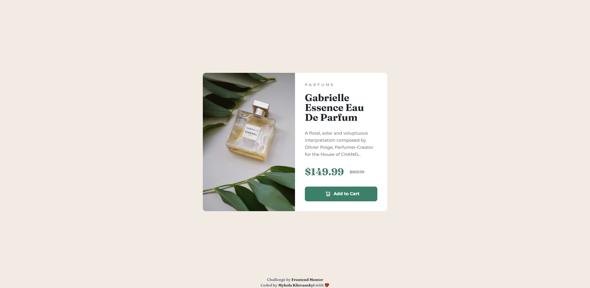
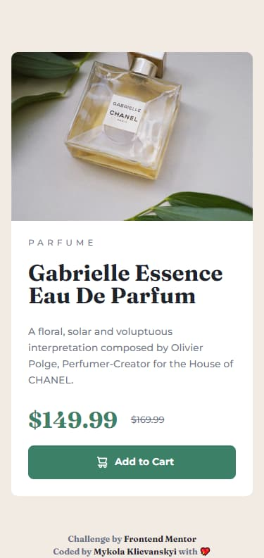

# Frontend Mentor - Product preview card component solution

This is a solution to the [Product preview card component challenge on Frontend Mentor](https://www.frontendmentor.io/challenges/product-preview-card-component-GO7UmttRfa). Frontend Mentor challenges help you improve your coding skills by building realistic projects. 

## Table of contents

- [Frontend Mentor - Product preview card component solution](#frontend-mentor---product-preview-card-component-solution)
  - [Table of contents](#table-of-contents)
  - [Overview](#overview)
    - [The challenge](#the-challenge)
    - [Screenshot](#screenshot)
    - [Links](#links)
  - [My process](#my-process)
    - [Built with](#built-with)
    - [What I learned](#what-i-learned)
  - [Author](#author)

## Overview

### The challenge

Users should be able to:

- View the optimal layout depending on their device's screen size
- See hover and focus states for interactive elements

### Screenshot

|

### Links

- Solution URL: [github](https://github.com/klievanskyi/fm-product-preview-card)
- Live Site URL: [fm-product-preview](https://fm-product-preview-card-klievanskyi.vercel.app/)

## My process

### Built with

- Semantic HTML5 markup (not sure :D)
- CSS custom properties, variable font
- Flexbox
- CSS Grid
- BEM methodology

### What I learned

Hey, colleagues!
I'm not a new frontend developer, but I found Frontend Mentor project and decided that it could be interesting to complete some challenges from the easiest to most complex mockups/apps, etc. It's my first one, and I tried such build tools as Vite, CSS custom properties(previously, I used scss variables) and better understood how srcsets, size, and other staff in img tag works. Oh, and of course, I got some practice with Vercel to deploy my solution.

Regarding questions, I have only one. I added a button with the role and some focus states, but I feel it's not enough. How can I improve a11y(accessibility) in the card?

## Author

- Github - [Mykola Klievanskyi](https://github.com/klievanskyi)
- Frontend Mentor - [@yourusername](https://www.frontendmentor.io/profile/klievanskyi)
- Twitter - [@klievanskyi](https://twitter.com/klievanskyi)
